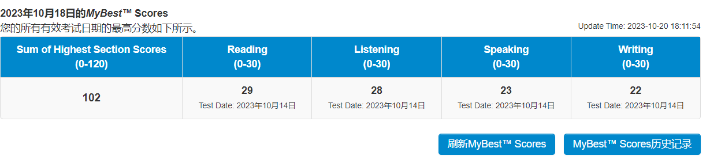

# TOFEL

## MyBest™Scores: 102

### Reading 29 Listening 28 Speaking 23 Writing 22

TOFEL essentials while I was preparing for my test on **2023/10/14**

1. **First test: 2023/10/14**

​	 Nankai University Balitai Campus Examination Center

2. ......

I am currently aiming to **pursue a master's degree at a top 30 CS university in the U.S.**

Continue to update

Feel free to contact me on batman6667@proton.me

# 托福

## 迄今最高分：102

### 阅读 29 听力 28 口语 23 写作22

1. 初考日期：2023/10/14

   南开大学八里台校区考点

我目前的目标是去往全美CS排名前30的院校攻读计算机相关领域方面的硕士

这是一些我在准备我10月14日考试前相关的资料

会持续更新

有任何疑问欢迎联系我的邮箱：erwinzhou021227@126.com
