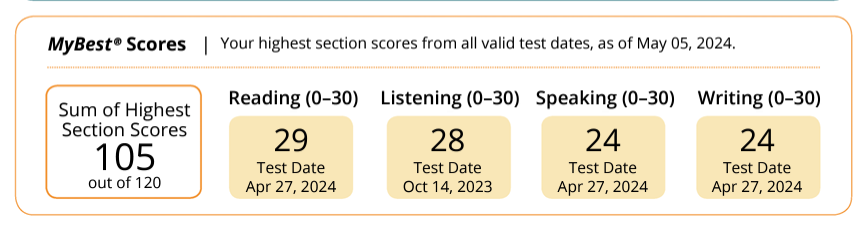
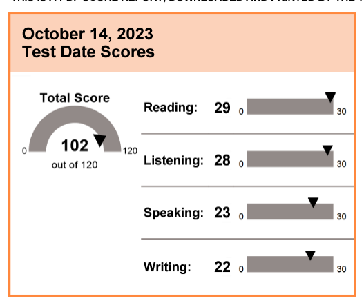
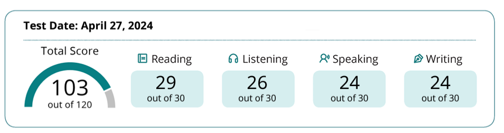

# TOEFL

## MyBest™Scores: 105

### Reading 29 Listening 28 Speaking 24 Writing 24

TOEFL essentials while I was preparing for my test on **2023/10/14, 2024/4/27**

1. **First test: 2023/10/14**

​	 Nankai University Balitai Campus Examination Center

2. **Second test:2024/4/27**

   Nankai University Balitai Campus Examination Center

   

I am currently aiming to **pursue a master's degree at a top 30 CS university in the U.S.**

Continue to update

Feel free to contact me on ErwinZhou@outlook.com

# 托福

## 迄今最高分：105

### 阅读 29 听力 28 口语 24 写作24

1. 初考日期：2023/10/14

   南开大学八里台校区考点
   
2. 二考日期：2024/4/27

   南开大学八里台校区考点

我目前的目标是去往全美CS排名前30的院校攻读计算机相关领域方面的硕士

这是一些我在准备我23年10月14日考试，24年4月27号前相关的资料和经验

会持续更新

有任何疑问欢迎联系我的邮箱：erwinzhou021227@126.com
